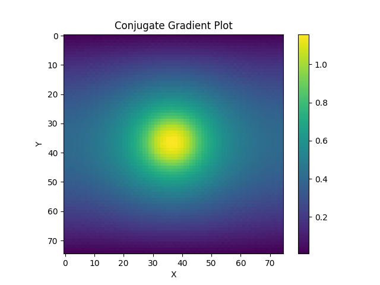

# Project 2 - Sparse Linear Solver (Conjugate Gradient Method)

## Information:
```
Name: Dhruv Srikanth
```
## Local System Information:
### Processor:

```
Chip:               Apple M1 Pro
Number of Cores:	8 (6 performance and 2 efficiency)
```

### Compiler:

```
Compiler:           GNU C++ compiler - g++
Version:            11
```

# Milestone 1 - Serial Implementation

The purpose of milestone-1 in project 2 is to develop a serial solver for linear systems using the conjugate gradient method.

## Run Instructions:
To run the conjugate gradient solver written in C++, follow these steps.

1. Enter the correct directory - 
```
cd milestone-1
```

2. Specify the input **n** in the Makefile (the variable is called **n**).

3. Build and run - 
```
make
```

This will generate the executable, run the code for the input **n** specified in Makefile, and generate the plots for the source vector **b** and the solution vector **x**.

The outputs can be found in the **milestone-1/output** directory.

## Results (Visualization):

### Inputs - 

1. n = 75
2. Source vector **b** - 


### Output - 

Solution vector **x** - 



## Results (Run Time, Memory Usage):

**Input -**

n = 75

**Run Time -** 

1. Dense solver = 27.50 seconds 

2. Sparse solver = 0.150056 seconds


**Estimated Memory Usage -**

1. Dense solver = 246.61 MB

2. Sparse solver = 0.225 MB


**Input -** 

n = 10000

**Estimated Memory Usage -**

1. Dense solver =  17592186029767.20 MB

2. Sparse solver = 4000 MB


# Milestone 2 - Parallel Implementation (Pure MPI)

The purpose of the final portion in project 2 is to develop a parallel solver for linear systems using the conjugate gradient method.

## Run Instructions:
To run the conjugate gradient solver written in C++, follow these steps.

1. Enter the correct directory - 
```
cd final-version
```

2. Specify the input **n** in the Makefile (the variable is called **n**).

3. Specify the number of MPI ranks in the Makefile (the variable is called **NODES**).

4. Specify the solver type (serial/parallel) in the Makefile (the variable is called **SOLVER_TYPE**)

5. Build and run -
MPI does not properly link on my local system, therefore, I pass the locations of the files to include and link in my Makefile. 

- Therefore, you can change the path to the files to include and link in the Makefile and run the following - 
```
make
```

**OR**

- You can use the backup bash script I have written called **run_backup.sh** in the following way (this uses mpic++ and is what I use on midway3 to compile, instead of g++-11 which I used on my local system to compile MPI code) - 
```
./run_backup.sh
```

**OR**

- You can use the **batch_file** to run the code on midway3.

Note:

If you run into permission issues on the bash script, run the following - 

```
chmod +x ./run_backup.sh
```

These steps will generate the executable, run the code for the input **n** specified in Makefile, and generate the plots for the source vector **b** and the solution vector **x**.

The outputs can be found in the **final-version/output** directory.

**Additional Information -**

To run visualize the results, run the following - 

```
python3 visualize.py
```

**OR**

Set the following in the Makefile.

```
visualize = true
```

To view the performance analysis graphs - 

1. Enter the timing values in **time1** and **time2** for strong and weak scaling analysis respectively in the performance_analysis.py script (corresponding to the number of MPI ranks provided in array **n**).

2. Run the following - 

```
python3 performance_analysis.py
```

## Results (Visualization):

I am using n = 200 for a comparisison between the results of the serial and parallel solvers.

### Serial Results

Source vector **b** - 


Solution vector **x** - 


### Parallel Results

Source vector **b** - 


Solution vector **x** - 


Note:

The solution vector for the **parallel** solver is incorrect. I have identified the function that is causing the issue. This is the **poisson_on_the_fly** function in **conjugate_gradient.cpp**. I believe the issue is an indexing issue, therefore, I do not think it would influence the timings and performance analysis of the solver.


### Performance Analysis

For reasons that I cover in the weak scaling analysis, through the timings were noted, I am choosing to perform the computation of S(n) using the grind rates. This would not make a difference to the graph in strong scaling analysis, however, will make a change to the graph in weak scaling analysis.

### Strong Scaling

Input - 

n = 2560

Data - 

| Number of MPI ranks   | Grind Rate (iter/s)
| ----------- | ----------- 
| 1           | 11
| 2           | 23
| 4          | 48
| 8          | 83
| 16          | 130
| 32          | 216
| 64          | 420

Graph - 


### Weak Scaling

In the weak scaling analysis, I use grind rate instead of time to compute S(n) since, the number of iterations the conjugate gradient algorithm runs for increases in the weak scaling experiments. This is because the value of **n*** (problem size) changes in weak scaling and this directly influences the number of iterations we run for (number of iterations = n*n). Therefore, I think a better way to measure and analyze speedup is through the grind rate. Therefore, I have computed the plot points below using grind rate and adjusting for this in the formula for S(n).

Data - 

| Number of MPI ranks   | Physical problem size (n) | Grind Rate (iter/s) 
| ----------- | ----------- | ----------- 
| 1           | 1024 | 80
| 2           | 1448 | 79
| 4          | 2048 | 78
| 8          | 2896 | 67
| 16          | 4096 | 57
| 32          | 5792 | 48
| 64          | 8192 | 39

Graph - 


As mentioned above, the weak scaling analysis is not accurate when computing S(n) using time and therefore, a better measure to analyze the speedup is to use the grind rate. Despite using the grind rate, I suspect that the reason that the weak scaling analysis is not (close to) a straight horizontal line, is due to the number of messages that need to be passed at **each** iteration of the algorithm. I believe that this is the reason for the graph looking so different from the weak scaling graphs we plotted for the advection/diffusion simulation in the previous project. 

The number of CG iterations required to converge changes with the problem size.