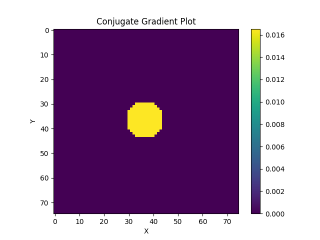
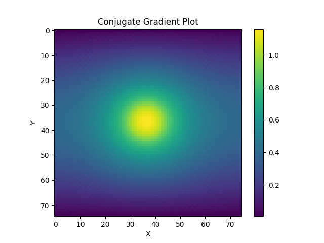

# Project 2 - Sparse Linear Solver (Conjugate Gradient Method)

The purpose of milestone-1 in project 2 is to develop a serial solver for linear systems using the conjugate gradient method.

## Run Instructions:
To run the conjugate gradient solver written in C++, follow these steps.

1. Enter the correct directory - 
```
cd milestone-1
```

2. Specify the input **n** in the Makefile (the variable is called **n**).

3. Build and run - 
```
make
```

This will generate the executable, run the code for the input **n** specified in Makefile, and generate the plots for the source vector **b** and the solution vector **x**.

The outputs can be found in the **milestone-1/output** directory.

## Results (Visualization):

### Inputs - 

1. n = 75
2. Source vector **b** - 



### Output - 

Solution vector **x** - 



## Results (Run Time, Memory Usage):

**Input -**

n = 75

**Run Time -** 

1. Dense solver = 27.50 seconds 

2. Sparse solver = 0.150056 seconds


**Estimated Memory Usage -**

1. Dense solver = 246.61 MB

2. Sparse solver = 0.225 MB


**Input -** 

n = 10000

**Estimated Memory Usage -**

1. Dense solver =  17592186029767.20 MB

2. Sparse solver = 4000 MB

